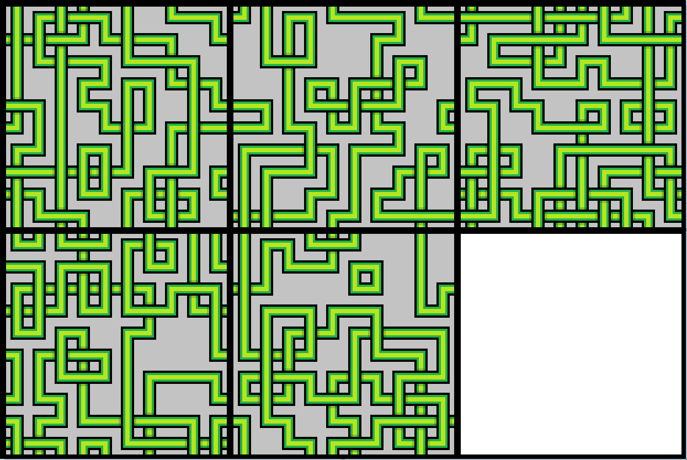
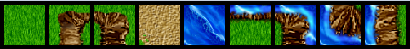
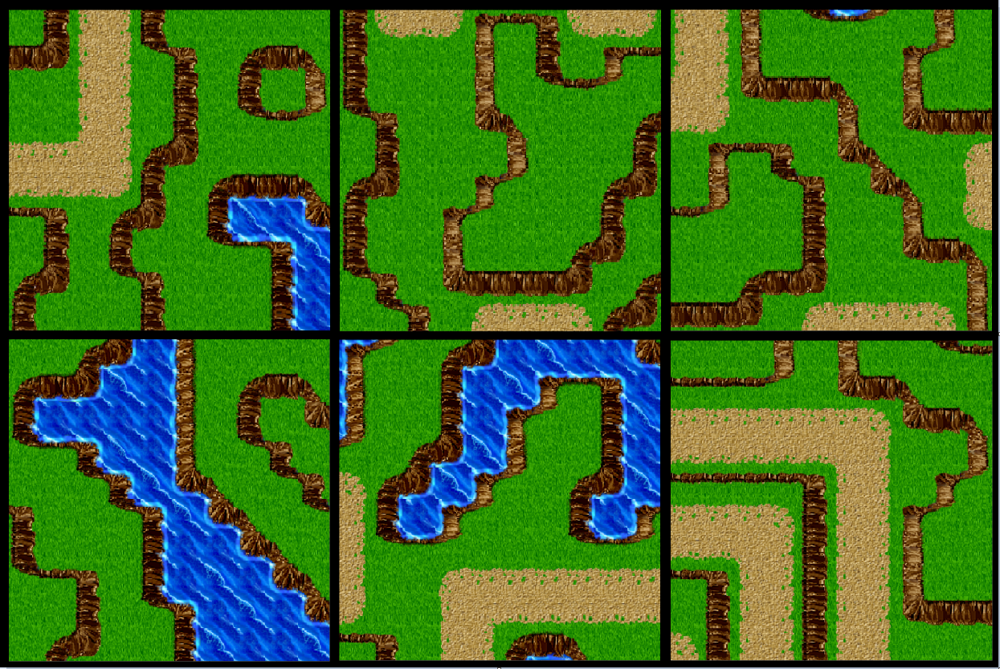

# Quantum Tilemap Generation

This Project generates tilemaps using quantum computing. It uses a set of sample tiles and tilemaps and generates new tilemaps that are similar. The generation algorithm is based on the Wavefunction Collapse Algorithm.

First, we represent our problem as a quadratic unconstrained binary optimization (QUBO) using a sample set of tilemaps. The QUBO is then solved on D-Wave's Quantum Annealer using Ocean SDK

# Objective Function
The objective function is a function of binary variables that represent qubits. We will represent our objective function as QUBO which would be used to generate new tilemaps.

## Objective Function Generation

Let **numMaps** be the number of sample maps.

Let **numTiles** be the number of tiles.

Let **numRows** be the number of rows in a tilemap.

Let **numColumns** be the number of columns in a tilemap.

Let,

Where,

the value is 1 if tile **t** is present at row **r** and column **c** in sample map **i**.

**AllowedTop** is the set of all pairs of tiles where 2nd tile is allowed to be on top of the first tile

**AllowedLeft** is the set of all pairs of tiles where 2nd tile is allowed to be on the left of the first tile

**AllCombinations** is the set of all possible pairs of tiles.

**NotAllowedTop** is the set of all pairs of tiles where 2nd tile is not allowed to be on top of the first tile.

**NotAllowedLeft** is the set of all pairs of tiles where 2nd tile is not allowed to be on the left of the first tile.

The Objective Function can then be defined as:-

To represent the Objective Function as QUBO, it needs to be simplified.

We know that,

So, the Objective Function can be simplified as:-

## Results

### Example 1

In this example, there are 9 tiles and a set of 5 sample maps with 10 rows and 10 columns.

#### Tiles

#### Sample Maps

#### Generated Maps

### Example 2
In this example, there are 40 tiles and a set of 1000 sample maps with 10 rows and 10 columns.

#### Tiles

Following are some of the tiles from the set of 40 tiles.

#### Sample Maps

Following are some of the sample maps from the set of 1000 sample maps.

#### Generated Maps

